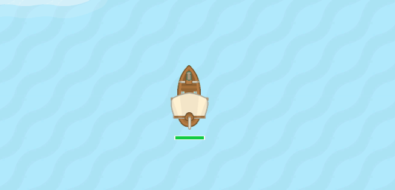
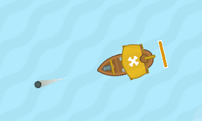
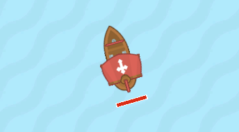
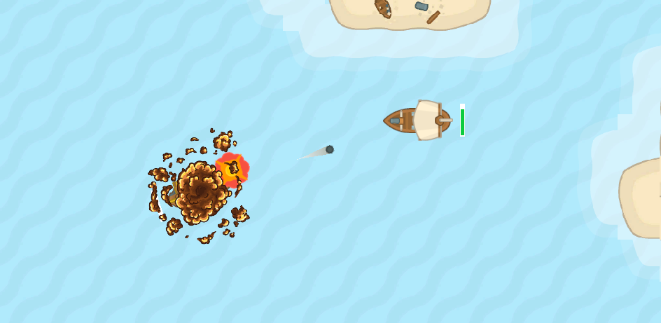

# Pirate's Fury: The Top-Down Shooter (Game Title)

Welcome aboard, matey! Step into the shoes of a fearless pirate captain in "Pirate's Fury," the swashbuckling Unity-based top-down shooter that will test your mettle on the high seas. Here's a quick guide to steer you through the currents of our GitHub repository.

---

## Game Overview

In "Pirate's Fury," you are tasked with a simple yet thrilling challenge: survive the onslaught of enemy ships and claim your victory over the treacherous waters! Each session is a fast-paced adventure lasting between 1 and 3 minutes - perfect for a quick gaming fix or endless hours of rivalry on the seas.

---

### Key Features

- Navigate your mighty ship through the perilous waters, gunning down foes and dodging isles.
- Engage enemies with your formidable arsenal: the precise Frontal Single Shot or the devastating Side Triple Shot.
- Outmaneuver or outgun two deadly types of enemies: the relentless Chasers and the devious Shotters.
- Explore a sea littered with treacherous islands, each a bulwark against both your vessel and your adversaries.
- Bear witness to the vivid animations depicting roaring cannons, crushing defeats, and the gradual wear on your ship as it takes damage.

---

## Controls & Mechanics

- Move Forward: ↑
- Rotate: →, ←
- Frontal Single Shot Attack: Space
- Side Triple Shot Attack: T



---

## Enemy Types

### Chaser:
These persistent foes will hunt you down relentlessly, pushing you to navigate with skill and speed.




### Shotter:
Cunning adversaries that will test your dodging prowess, shooting from a distance with deadly accuracy.



---

## Environments

### Islands:
Natural barriers that offer strategic challenges and opportunities within the game's arena.
  
*(Include a screenshot or small gif showcasing the islands and how they affect gameplay.)*

---

## Visuals & Animations

- **Ship Deterioration**: As your ship takes damage, observe it gradually come apart, reflecting your health status in a visually impactful way.
- **Death and Shoot Animations**: Feel the impact of every cannon blast and grimace as ships meet their watery demise.

---

## Getting Started

Before you set sail, ensure you've got everything you need:

1. **Clone the repository**:
```git
git clone https://github.com/Mizuiky/Pirate-Game-Painful-Smile-Test
```
2. **Open the project in Unity**:
Ensure you have Unity 2202.3 installed. Once opened, navigate through the project files to find the _Main Menu Scene_ and hit play to start the editor preview.

---

## Feedback and Contributions

Hoist the sails for collaborative tides! If you'd like to contribute or have feedback to share, please follow the contribution guidelines in this repository or drop us a line in the "Issues" section.

---

Thank you for visiting the "Pirate's Fury" GitHub repository. May the winds be favorable, and your cannons ever swift!

